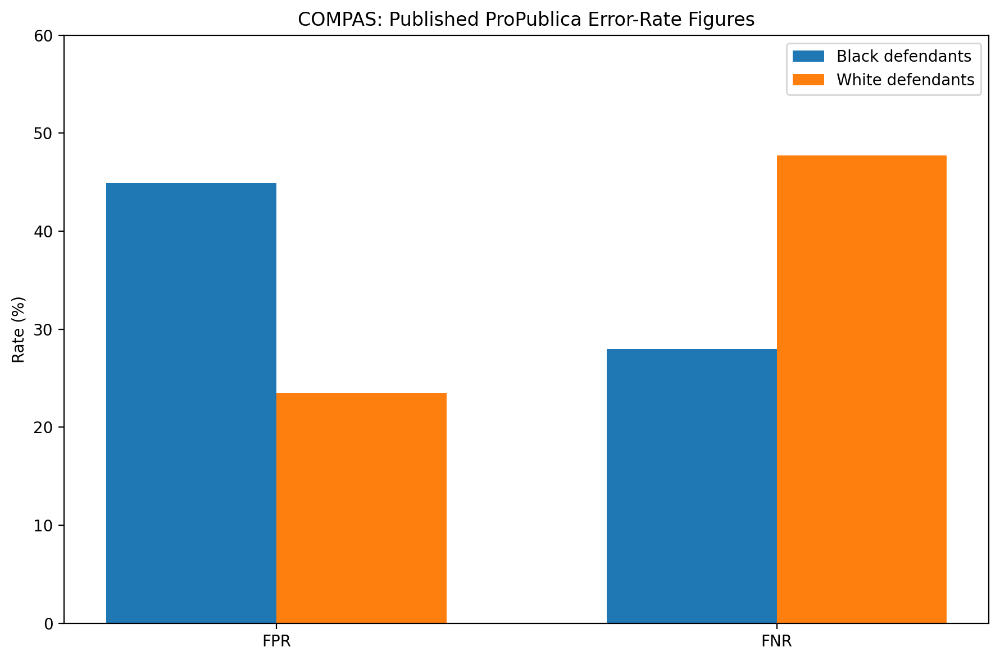
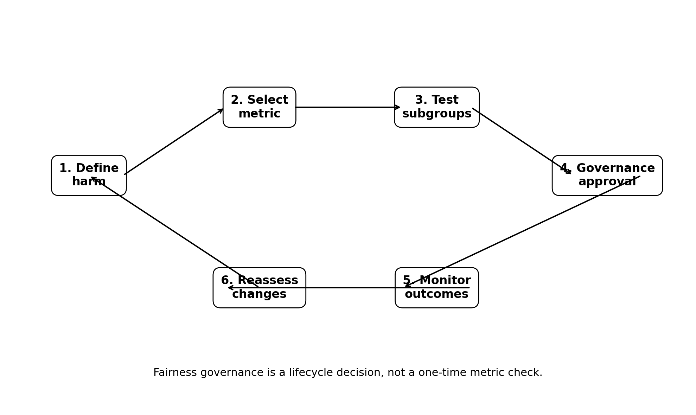

# compas-bias-audit
"Fairness audit of the COMPAS recidivism algorithm using NIST-aligned bias metrics"
# COMPAS Bias Audit — Fairness, Risk & Governance Case Study

**Portfolio Project 1 of 5 | AI Ethics, Algorithmic Fairness & AI Governance**

This case study examines the COMPAS recidivism risk-assessment tool and the fairness controversy discussed in ProPublica's 2016 investigation.

The purpose is not to reduce the case to a one-line verdict. Instead, the project demonstrates a governance skill that is directly transferable to high-stakes AI: identifying which fairness definitions are being evaluated, understanding why they can produce different conclusions, documenting the trade-offs, and translating the findings into governance controls.

## Case-study scope

The final assessment describes COMPAS as a proprietary actuarial risk-assessment instrument that scores criminal defendants on a 1–10 scale. The analysis uses the Broward County dataset discussed in ProPublica's work, covering records collected in 2013–2014 and two-year rearrest outcomes.

The commonly reported figure of approximately 137 input variables is explicitly treated in the report as **commonly reported, not independently verified**, because the underlying scoring methodology is proprietary.

## Key evidence reproduced from the final assessment

| Metric | Black defendants | White defendants |
|---|---:|---:|
| False positive rate | 44.9% | 23.5% |
| False negative rate | 28.0% | 47.7% |

These figures are presented as the figures originally published by ProPublica. The project also records a methodological critique by Barenstein (2019) concerning ProPublica's data-processing cutoff and treats that critique as a limitation on the precision of the published rate figures.

## Governance lesson

The assessment documents two findings that must be considered together:

- error-rate disparities were reported across race; and
- COMPAS was also found to be approximately calibrated across race in the literature discussed.

The project explains the mathematical reason these can coexist when subgroup base rates differ. It therefore avoids treating one fairness statistic as a universal definition of fairness.

## What this repository demonstrates

| Capability | Artifact |
|---|---|
| Evidence trail | `01_Research/` + `02_Sources/` |
| Fairness-metric analysis | `03_Fairness_Analysis/fairness_metrics.md` |
| Quantitative evidence | `03_Fairness_Analysis/fairness_metrics.csv` |
| Governance interpretation | `04_Governance/governance_interpretation.md` |
| Decision framework | `04_Governance/fairness_metric_decision_record.md` |
| Practical controls | `05_Controls/fairness_control_matrix.md` |
| Visual communication | `06_Visuals/` |
| Full case study | `07_Final/COMPAS_Bias_Audit_Final.pdf` |

## Limitations

This is a historical case study, not an assessment of a current production deployment. The final report cautions that the underlying outcome is rearrest rather than reoffense, that the causal mechanism behind observed disparities is not established by the analysis alone, and that findings from the 2013–2014 Broward County dataset should not automatically be generalized to other contexts.
